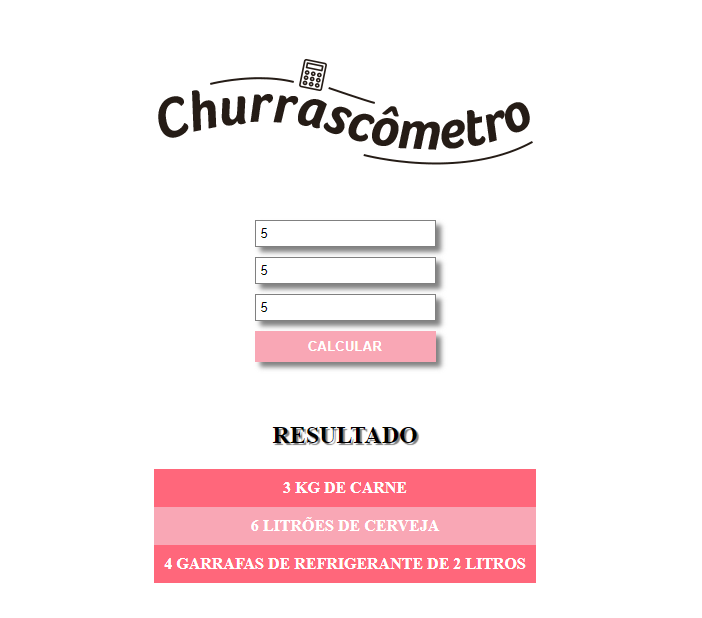

<h1 align="center"> Churrascômetro </h1>

Este projeto foi desenvolvido com a guia do programadorBR através do curso de desenvolvimento WEB.  

  

 

  

## 🚀 Tecnologias

Esse projeto foi desenvolvido com as seguintes tecnologias:

- HTML e CSS
- JavaScript
- Git e Github

## 💻 Projeto

O churrascômetro é uma calculadora de churrasco, que retorna os materiais para um churrasco de acordo com a quantidade de pessoas e a duração do churrasco.

- [Visite o projeto online](https://miguelsabino23.github.io/Churrascometro/)

## :memo: Licença

Esse projeto está sob a licença MIT.

---

